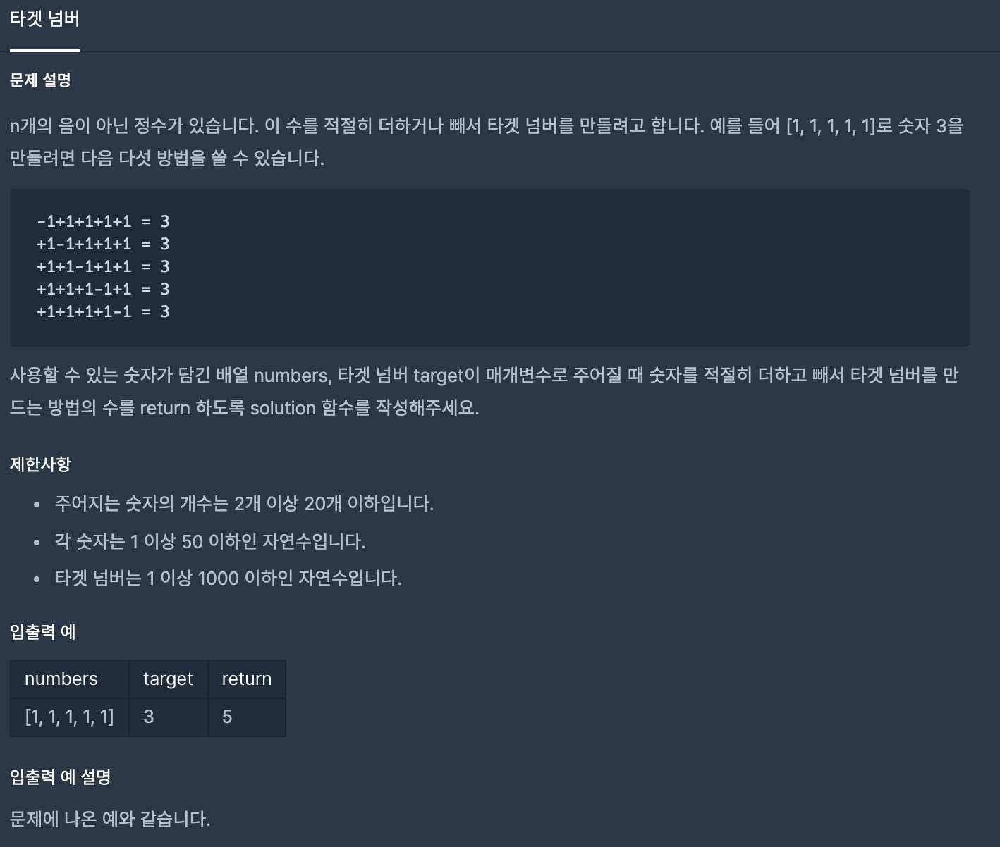

# [ Programmers - Target Question ] - [ 내가 생각한 핵심 ]
>
* 문제 설명

>
* 모든 하나씩 더하고 빼서 배열에 있는 모든 수를 연산 했을 때 마지막 수가 target 넘버와 
  일치하는지 확인 하면 된다. 
>
* 재귀 함수를 사용함으로 시간 복잡도는 O(2^n)이다.
---
* 뭔가 DFS로 풀어야된다는 생각이 들지는 않는다.(DFS는 맞다)