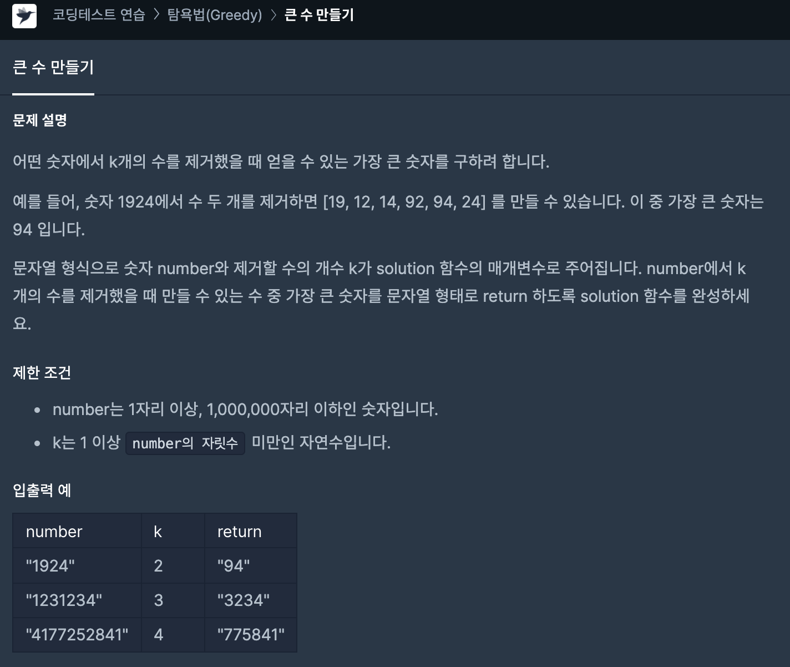

# [ Programmers - Big Num Question ] - [ 내가 생각한 핵심 ]
>
* 문제 설명

> 
* 빼는 숫자의 수 -> 무조건 만들어져아하는 숫자의 길이 
  - 예를 들어 7개 숫자 중에 3개를 빼야한다면 무조건 4개의 숫자가 만들어져야함.
>
* 해당 숫자로부터 뒤에서 일정범위 이내에는 포함되어야함.
  - 예를 들어 1234567의 숫자 중에 3개를 뺀 4개의 숫자를 만들어야하는 경우  뒤에셔 4번째까지 범위(1~4)에서는 무조건 하나를 선택해야함.
>
* 해당 범위에서 가장 큰 값을 선택하고 선택한 범위까지 숫자를 삭제 
  - 예를 들어 1234567에서  4를 선택했다면 다음 선택할 때는 456에서 선택 
>
* 범위를 정할 때는 target 숫자의 길이에서 선택해야하는 범위를 뺀 위치까지 선택
  - 1234567dptj 4개를 선택해야하는 경우 : x<=7(target 숫자 길이)-4(선택해야하는 수) -> 3번째까지
---
* 몇개를 빼라는 것은 전체 숫자에서 몇번째 범위에서 하는 뽑아야된다는 뜻
 - 여기서는 k이하의 범위에서 찾아야한다는 것이다
>
* 주의할 점은 greedy 이므로 다음 검색할때 이미 선택된 부분을 제외하고 선택
 - 1~3번째 수 중에 가장 큰 수를 골랐으면 고른 수까지 제외하고 다음부터 검색해야 시간초과가 발생하지 않는다