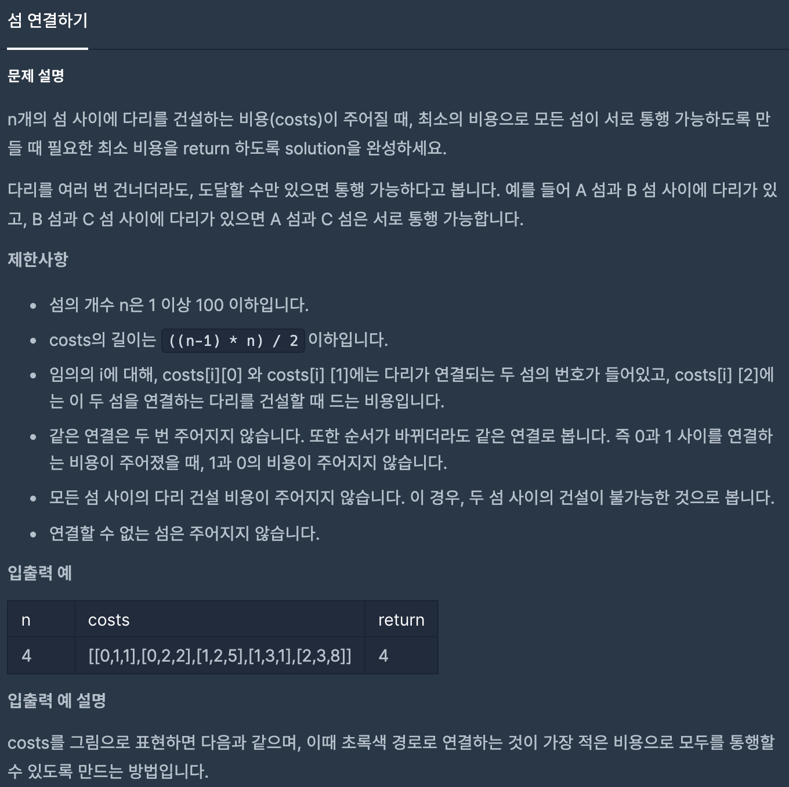
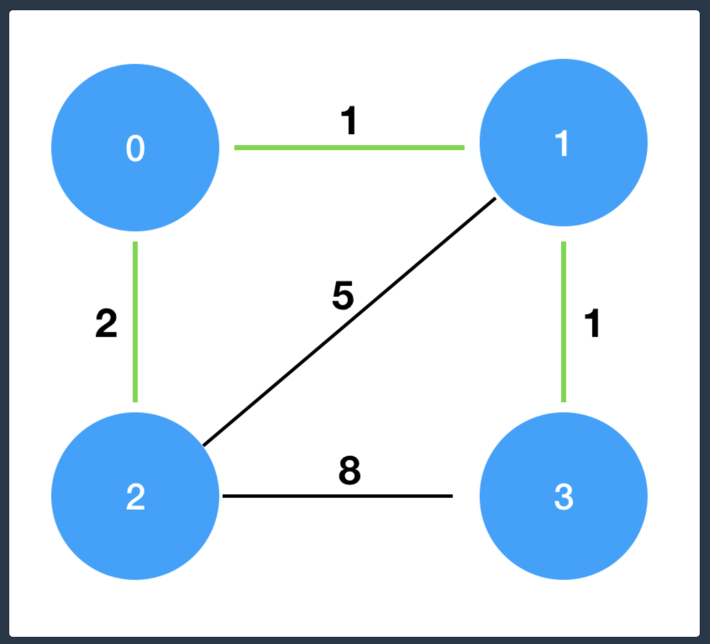

# 섬 연결하기  

>
* 문제 정의
   - MST(최소 비용 신장 트리)를 크러크컬 알고리즘을 이용하여 구하는 문제.

* 크러스컬 알고리즘
  - 최소 비용의 간선으로 구성(비용을 오름차순으로 정렬)하고, 간선들을 연결할 때 해당 간선을 연결하게되면 
    사이클이 발생 되는 경우(해당 간선의 양쪽 노드의 부모 노드가 같은 경우)를 제외 해야함. 

* 크로스컬 알고리즘 작동 방식 
  - (1) 간선들의 비용을 오름차순으로 정렬
  - (2) 가장 작은 비용의 간선의 양쪽 노드의 부모 노드 검색(재귀 함수 이용)하고 비교
  - (3) 양쪽 노드의 부모 노드의 값이 같지 않다면, 작은 값을 저장
  - (4) 부모 노드가 같지 않다면 간선 설치(비용 추가)하고, 같다면 간선 설치하지 않음

* Test Case
  - n / costs / answer
  - 5 [[0, 1, 5], [1, 2, 3], [2, 3, 3], [3, 1, 2], [3, 0, 4], [2, 4, 6], [4, 0, 7]] 15
  - 5 [[0, 1, 1], [3, 4, 1], [1, 2, 2], [2, 3, 4]] 8
  - 4 [[0, 1, 5], [1, 2, 3], [2, 3, 3], [1, 3, 2], [0, 3, 4]] 9
  - 5 [[0, 1, 1], [3, 1, 1], [0, 2, 2], [0, 3, 2], [0, 4, 100]] 104
  - 5 [[0, 1, 1], [2, 3, 1], [3, 4, 2], [1, 2, 2], [0, 4, 100]] 6
  - 5 [[0, 1, 1], [0, 4, 5], [2, 4, 1], [2, 3, 1], [3, 4, 1]] 8
  - 5 [[0, 1, 1], [0, 2, 2], [0, 3, 3], [0, 4, 4], [1, 3, 1]] 8
  - 6 [[0, 1, 5], [0, 3, 2], [0, 4, 3], [1, 4, 1], [3, 4, 10], [1, 2, 2], [2, 5, 3], [4, 5, 4]] 11

* 참고
  - https://www.evernote.com/shard/s610/sh/ba2d4551-f507-4acf-a385-467ee276067f/3a3d226b3c3c46f903d4bd045fa7713e
  

 
    