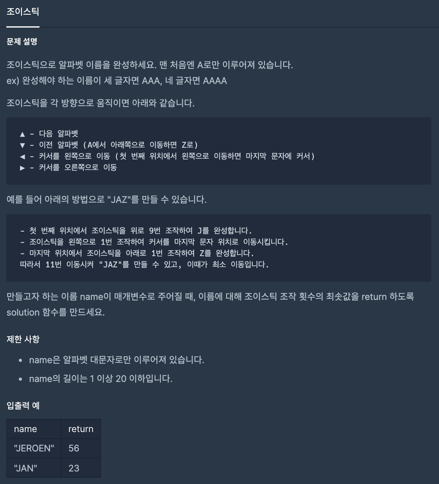
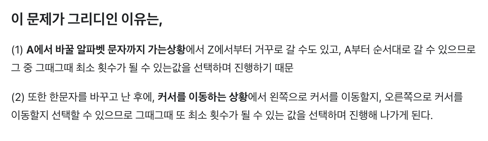

# [ Programmers - Joystick Question ] - [ 내가 생각한 핵심 ]
>
* 문제 셜명

>
* Greedy 문제
>

---
* 나는 그리디 문제라는 인식을 가지고 풀지는 않았다 하지만 설명을 듣고 나니 명확한 Greedy문제 인줄 알았다 
  - 알파벳을 완성할 때 위, 아래 가든지 둘 중의 최소 횟수(그때 그때 최적의 해)를 선택하면 됨.