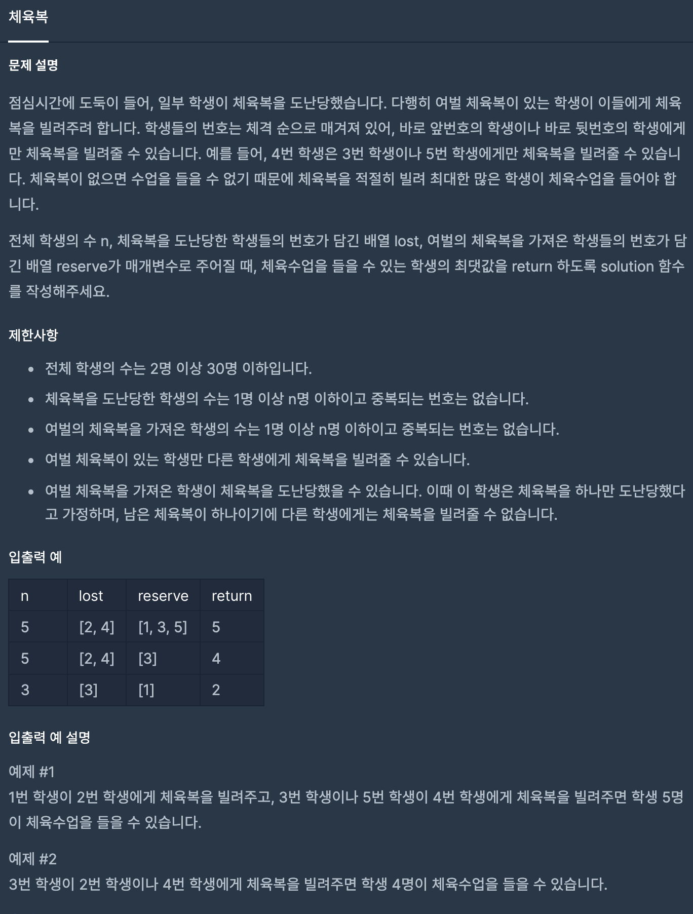

# [ Programmers - Delivery Question ] - [ 내가 생각한 핵심 ]
>
* 문제 설명

>
* Greedy 문제
>
* 옷을 최초 모두 한벌씩 가지고 있다고 가정하고 해당 배열을 1로 초기화한다 
>
* 옷을 잃어버린 사람 위치의 배열에서 1을 뺀다. 
> 
* 옷의 여벌을 가지고 있는 사람 위치의 배열에서 1을 더한다.
> 
* 해당 위치에 사람이 2벌을 가지고 있으면 앞의 사람이 옷이 없는지 확인한다.
  - 확인해서 없으면 1벌을 빌려줌으로 1 벌씩 만들어준다
>
* 해당 위치에 앞에 사람이 이미 있다면 뒤에 사람이 여벌의 옷이 없는지 확인한다. 
  - 확인해서 없으면 1벌을 빌려줌으로 1벌씩 만들어준다. 
>
---
* Greedy 라고 생각되는 이유(정확하지 않지만)
  - 2벌가지고 있는 사람의 앞에 있는 사람이 옷을 가지고 있는 아닌지 확인하고 없으면 뒤를 확인한다. 
  - 이 방식은 바로 앞에 있는 사람이 있는지 없는지만 판단하는 방법이므로 Greedy 문제라고 볼 수 있을 것 같다. 
* 하지만 Greedy라는 것을 완벽하게 이해하고 한 것이 아니기 때문에 Greedy 해결 방식으로 했다라고 할 수 없을 것 같다.

